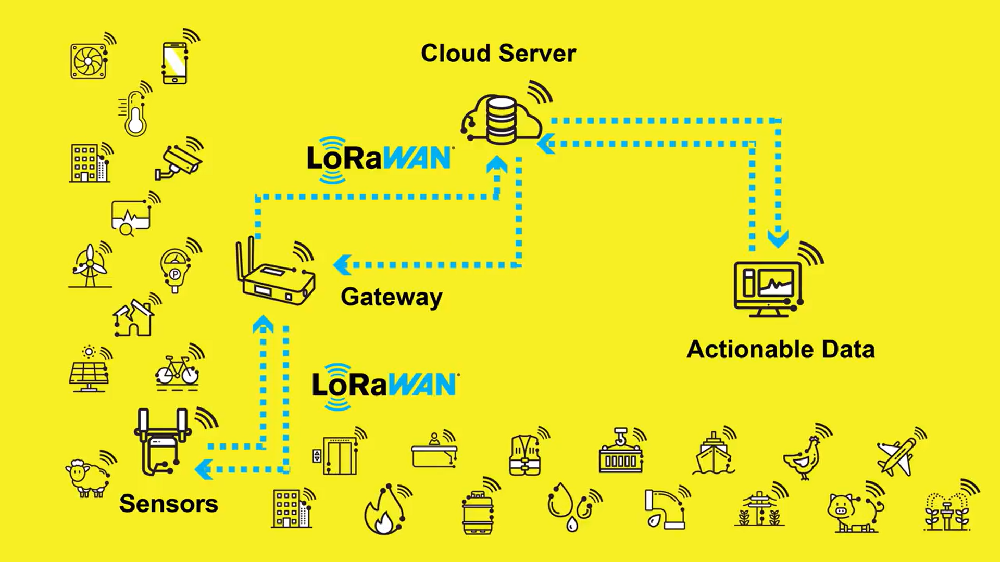
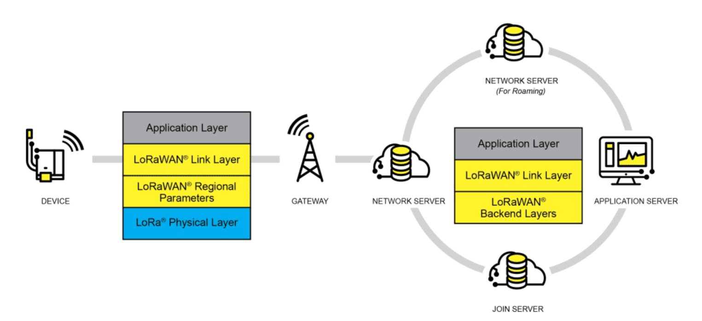

Este texto serve como apoio ao estudo do tema

# **LoRaWAN**

## **Introdução**

A especificação **LoRaWAN** define um protocolo de comunicação sem fio que constitui um ecossistema de rede de baixa potência e longo alcance (*LPWAN* - *Low Power Wide Area Network*) para *IoT* (Internet das Coisas), ideal para projetos operados por bateria com taxa de dados reduzida. O protocolo segue as especificações mantidas pela LoRa Alliance, atualmente na versão 1.0.4, com extensão 1.1 voltada a funcionalidades avançadas de roaming e segurança.  
Um diagrama introdutório de uma rede **LoRaWAN**, com diversos casos de uso, é apresentado a seguir:  

  
*fonte: LoRa Alliance*  

As principais características dessa rede são:  
* Atende tanto aplicações comerciais quanto de entusiastas amadores, podendo ser implementada em redes privadas, públicas, comunitárias ou até via satélite.  
* Especialmente indicada para atender aplicações em áreas remotas.  
* Seu sinal é capaz de atravessar obstáculos, possibilitando aplicações subterrâneas.  
* Baixa taxa de dados e, por consequência, largura de banda limitada.  
* Usa faixas de frequência não licenciadas, o que implica em gratuidade.  
* Permite o uso de criptografia e autenticação.  
* Baixo custo de implantação.  
* Padrão aberto e em evolução, com ampla comunidade de colaboradores e diversos fornecedores de dispositivos.  
* Permite o gerenciamento de *gateway*s por diversos servidores LoRaWAN na nuvem (ChirpStack, TTN, LORIOT, Everynet, ThingPark, e outros, segundo iotfactory.eu), possibilitando integração com dashboards e sistemas de inteligência artificial.  

Abaixo, apresenta-se uma tabela comparativa entre redes populares:

| Tecnologia  | Alcance Típico                          | Taxa de Dados (aprox.)                | Consumo de Energia         | Faixa de Frequência Típica        | Observações Principais |
|--------------|-----------------------------------------|--------------------------------------|-----------------------------|----------------------------------|------------------------|
| **Wi-Fi**    | 50 – 100 m (interno), até 300 m (externo) | 10 Mbps – 1 Gbps (dependendo da versão) | Alto                        | 2.4 GHz, 5 GHz, 6 GHz (Wi-Fi 6E) | Alta velocidade, ideal para internet doméstica e transmissão de dados. |
| **Bluetooth**| 10 – 100 m (classe e versão)             | 1 Mbps (Classic), até 2 Mbps (BLE 5.0) | Baixo a muito baixo (BLE)   | 2.4 GHz (banda ISM)              | Voltado para conexões pessoais e *IoT* de curto alcance. |
| **LTE (4G)** | 1 – 10 km (urbano), até 30 km (rural)   | 10 Mbps – 100 Mbps (categoria e banda) | Médio a alto                | 700 MHz – 2.6 GHz (dependendo do país) | Oferece mobilidade e ampla cobertura via operadoras celulares. |
| **LoRa**     | 2 – 15 km (urbano), até 30 km (rural)   | 0,3 – 50 kbps                        | Muito baixo                 | 868 MHz (Europa), 915 MHz (Américas), 433 MHz (Ásia) | Ideal para *IoT* de longo alcance e sensores de baixa taxa de transmissão.  

Embora os termos LoRa e LoRaWAN sejam frequentemente usados juntos, ou de maneira intercambiável, eles representam conceitos distintos e complementares dentro do ecossistema de comunicações para Internet das Coisas (*IoT*). O termo LoRa refere-se exclusivamente à camada física do sistema — isto é, ao método de modulação baseado em *Chirp Spread Spectrum (CSS)*, responsável por transmitir sinais de rádio de longo alcance com baixo consumo de energia, baixa taxa de dados e alta imunidade a ruído. Em outras palavras, LoRa define como os bits são enviados pelo ar. Já o LoRaWAN é um protocolo de comunicação de nível superior, que opera sobre a modulação LoRa e define como os dispositivos, gateways e servidores interagem dentro de uma rede. Ele estabelece as regras de endereçamento, autenticação, enfileiramento de mensagens, controle de taxa de dados, e todo o modelo de segurança baseado em chaves AES-128.  
Enquanto LoRa é uma tecnologia física (hardware e rádio), LoRaWAN é a arquitetura lógica e de rede que viabiliza a criação de sistemas *IoT* completos, com múltiplos dispositivos, servidores e aplicações seguras e interoperáveis.  

---

## **Topologia da Rede LoRaWAN**

A topologia da rede LoRaWAN segue um modelo em estrela de estrelas (*star-of-stars*). Nessa arquitetura, os nós sensores (*end devices*) se comunicam diretamente com um ou mais *gateways* por meio de um *link* LoRa de longa distância, utilizando modulação LoRa (baseada em *Chirp Spread Spectrum* - CSS). Essa técnica de modulação, CSS, consiste em utilizar sinais conhecidos como chirps — pulsos cuja frequência varia continuamente ao longo do tempo, aumentando (*up-chirp*) ou diminuindo (*down-chirp*) dentro de uma faixa de banda específica. Essa variação gradual da frequência permite que o receptor identifique o início e o conteúdo do sinal mesmo em condições de ruído intenso ou interferência. Diferentemente das modulações convencionais, o CSS combina robustez e alcance estendido, pois espalha a energia do sinal ao longo de uma banda mais larga, tornando-o resistente a ruídos e a perdas por desvanecimento (*fading*). Além disso, o CSS permite transmissões com baixo consumo de energia e alta sensibilidade de recepção, características ideais para dispositivos *IoT* que operam em longas distâncias com baterias.  
Os *gateways*, por sua vez, não fazem roteamento nem tomam decisões locais: eles apenas recebem os pacotes LoRa e os encaminham para um servidor de rede LoRaWAN através de conexões IP (Ethernet, Wi-Fi, LTE, ou satélite).  

### 1. **Componentes principais da topologia**

1. **Sensores (*End Devices*)**

   * São dispositivos de campo, alimentados por bateria, responsáveis por medir variáveis (como temperatura, umidade, pressão, nível de reservatórios, luminosidade, movimento, entre outros).  
   * Operam com baixo consumo de energia e transmitem dados periodicamente ou sob eventos específicos.  
   * Cada sensor é identificado por um **Device EUI** (um identificador único global).  
   * Eles se comunicam apenas com os *gateway*s — não entre si — o que reduz complexidade e consumo.  

2. ***Gateways***

   * Funcionam como pontes entre o mundo LoRa e a Internet.  
   * Recebem pacotes LoRa de múltiplos dispositivos dentro de sua área de cobertura (que pode ultrapassar 10 km) e os encaminham via IP para o servidor de rede LoRaWAN.  
   * São capazes de operar em redes públicas ou privadas.  
   * Em uma mesma rede, vários *gateway*s podem ouvir o mesmo pacote, aumentando a confiabilidade da comunicação, o que se costuma chamar de diversidade espacial. Isso significa que um *end device* pode ser ouvido simultaneamente por vários *gateways*, aumentando a confiabilidade.  

3. **Servidor de Rede (*Network Server*)**

   * Atua como o cérebro do sistema LoRaWAN.  
   * Verifica a autenticidade dos dispositivos, elimina duplicatas, gerencia as janelas de recepção (*Receive Windows* - ativação da recepção por breves intervalos após cada transmissão para ouvir possíveis respostas (mensagens *downlink*) da rede) e aplica criptografia AES-128 para garantir a segurança dos dados.  
   * Também decide qual *gateway* deve responder a cada dispositivo (no caso de mensagens *downlink*).  
   * É normalmente hospedado em nuvem, conforme mostrado na figura, e pode ser implementado em uma das plataformas anteriormente mencionadas.  

4. **Servidor de Aplicação (*Application Server*)**

   * É o destino final dos dados processados.
   * Converte as mensagens LoRaWAN (criptografadas e codificadas) em informações legíveis, integrando-as a bancos de dados, dashboards, ou sistemas de inteligência artificial.  
   * Na figura, aparece como o bloco *Actionable Data*, que exibe os resultados em sistemas de análise e controle.  

### 2. **Fluxo de comunicação**

1. **Envio (*Uplink*):**
   * O sensor coleta uma medida e transmite via LoRa.  
   * O sinal é captado por um ou mais *gateway*s e encaminhado para o servidor de rede pela Internet.  
   * O servidor de rede valida o pacote e o repassa ao servidor de aplicação, onde os dados são decodificados e armazenados.  

2. **Resposta (*Downlink*):**
   * Caso seja necessário enviar um comando ao dispositivo (por exemplo, alterar a taxa de transmissão ou atualizar um firmware), o servidor de aplicação envia a instrução de volta ao servidor de rede, que escolhe o *gateway* mais apropriado para transmitir o pacote de retorno.  
   * Um dos pontos mais sutis e importantes do funcionamento do LoRaWAN é o controle de confirmação de mensagens, que define quando e como o servidor pode informar ao dispositivo **end device** que um **uplink** foi recebido corretamente. Cada **end device** abre duas janelas sequenciais (RX1 e RX2) após enviar um pacote: Se o servidor precisar responder, deve fazê-lo dentro de uma delas. Esse mecanismo de ACK (**Acknowledgment**) garante sincronização eficiente entre dispositivo e rede, reduzindo o tempo em que o rádio fica ativo e, consequentemente, economizando energia. Ele é descrito a seguir.  

### 3. **Mensagens confirmadas e não confirmadas**

1. **Mensagens confirmadas e não confirmadas:**
No LoRaWAN, cada **uplink** (mensagem do **end device** para a rede) pode ser enviado de duas formas:  

| Tipo de *uplink*          | Descrição                                                                                    | Reação do servidor                                                                                      |
| ----------------------- | -------------------------------------------------------------------------------------------- | ------------------------------------------------------------------------------------------------------- |
| **Unconfirmed Data Up** | O dispositivo envia dados e **não espera resposta**.                                         | O servidor apenas processa os dados. Não há **downlink** de confirmação.                                  |
| **Confirmed Data Up**   | O dispositivo **solicita um reconhecimento (ACK)** do servidor para confirmar o recebimento. | O servidor envia um **downlink** contendo o bit de **ACK = 1**, indicando que os dados chegaram íntegros. |

Essa confirmação é uma funcionalidade padrão (*default*) do protocolo LoRaWAN.  

2. **O que acontece se o ACK não vier:**
Quando um **end device** envia uma mensagem confirmada e não recebe o ACK durante as janelas de recepção (RX1 ou RX2), ele retransmite automaticamente a mesma mensagem, seguindo uma lógica configurável:  

* Há um número máximo de tentativas (NbTrans) definido no firmware do dispositivo (geralmente de 1 a 8).  
* A cada retransmissão, o dispositivo pode aumentar a potência de transmissão ou usar outro canal (mecanismo **Adaptive Data Rate**, ADR).  
* Após exceder o limite de tentativas sem ACK, o dispositivo considera a mensagem perdida e registra um erro local, sem travar o sistema.  

Essa retransmissão automática é parte da especificação do LoRaWAN — não depende do servidor e não requer configuração adicional, embora os parâmetros possam ser ajustados.  

3. **Comportamento configurável:**
O uso de mensagens confirmadas (**com ACK**) ou não confirmadas (**sem ACK**) é definido pela aplicação. Ou seja:  

* O desenvolvedor do dispositivo decide, para cada tipo de dado, se deve usar o modo confirmado ou não.  
* O servidor LoRaWAN (como ChirpStack ou TTN) reconhece automaticamente as mensagens confirmadas e responde com o **downlink** de ACK, sem necessidade de lógica adicional.  

Exemplo prático:  

* Um sensor de temperatura que envia leituras a cada 10 minutos pode usar ***uplink*s não confirmados** (sem ACK), pois eventuais perdas são aceitáveis.  
* Já um atuador ou sistema crítico pode usar ***uplink*s confirmados**, garantindo que a rede realmente recebeu o comando.  

4. **Resumo do mecanismo:**

| Etapa | Ação                                           | Tipo de Mensagem        | O que acontece                                                        |
| ----- | ---------------------------------------------- | ----------------------- | --------------------------------------------------------------------- |
| 1     | End device envia dados                         | *Unconfirmed Data Up*   | Servidor recebe e processa; sem resposta.                             |
| 2     | End device envia dados solicitando confirmação | *Confirmed Data Up*     | Servidor envia **downlink** com bit **ACK = 1** dentro da RX1 ou RX2.   |
| 3     | Se o ACK não chegar                            | —                       | End device retransmite até atingir NbTrans.                         |
| 4     | Servidor quer enviar comando adicional         | *Downlink Data Message* | Pode incluir novos dados além do ACK (por exemplo, mudar parâmetros). |

### 4. **Tipos de redes LoRaWAN**

O protocolo suporta múltiplos **modelos de implantação**:

* **Rede pública:** gerida por provedores (como Everynet), cobrindo grandes áreas urbanas e rurais.  
* **Rede privada:** configurada por empresas, municípios ou instituições, com *gateway*s e servidores próprios.  
* **Rede comunitária:** colaborativa, como a oferecida pela **The Things Network (TTN)**.  
* **Rede via satélite:** usada em locais sem infraestrutura terrestre, empregando *gateway*s que se comunicam com satélites LoRaWAN.  

### 5. **Segurança na topologia**

A comunicação LoRaWAN utiliza duas camadas independentes de criptografia AES-128:  
* **Network Session Key (NwkSKey):** garante a integridade e autenticação do pacote na camada de rede.  
* **Application Session Key (AppSKey):** protege o conteúdo dos dados transmitidos na camada de aplicação.  
Essas chaves são geradas durante o processo de **ativação**, que pode ocorrer de duas formas:  
* **OTAA (*Over-The-Air Activation*):** método dinâmico e mais seguro.  
* **ABP (*Activation by Personalization*):** configuração manual, menos segura, porém simples para testes.  

O modelo de segurança do LoRaWAN é de ponta a ponta (*end-to-end*), garantindo que apenas o servidor de aplicação consiga decifrar o conteúdo das mensagens, mesmo que intermediários participem da transmissão.  

### 6. **Resumo visual**

A figura apresentada na introdução representa essa estrutura:  

* **Na base**, diversos sensores LoRa (medindo temperatura, energia, água, pressão, movimento etc.) comunicam-se com **um *gateway* LoRaWAN**.  
* O *gateway* transmite os dados para o **servidor na nuvem (**Cloud Server**)**, onde ocorre o processamento.  
* Por fim, as informações são convertidas em **dados acionáveis (**Actionable Data**)**, prontos para análise, controle ou tomada de decisão.  

Em suma, a arquitetura **LoRaWAN em estrela de estrelas** oferece simplicidade, escalabilidade e eficiência energética. Essa estrutura permite abrangência de grandes áreas com baixo custo de infraestrutura, ideal para aplicações de monitoramento ambiental, agricultura de precisão, cidades inteligentes, rastreamento de ativos e automação industrial.  

---

## **Arquitetura LoRaWAN e Camadas do Protocolo**

Após compreender a topologia em estrela de estrelas, é possível detalhar a arquitetura em camadas que sustenta o funcionamento do protocolo LoRaWAN.  
A arquitetura LoRaWAN é organizada em camadas funcionais, conforme mostrado na figura abaixo, e segue um modelo modular que divide e separa as responsabilidades entre o *end device*, o *gateway*, o servidor de rede, o servidor de aplicação e, opcionalmente, o servidor de autenticação (*Join Server*).

  
*fonte: LoRa Alliance*  

Essa divisão permite interoperabilidade, segurança e escalabilidade, além de facilitar o desenvolvimento de aplicações *IoT* sobre uma base de comunicação padronizada.  

### 1. **Camadas do dispositivo final (*End Device*)**

O *end device* é o nó da rede responsável por coletar e transmitir dados. Ele é composto por três camadas principais:

1. **Camada Física – *LoRa Physical Layer*:**
   * Implementa a modulação LoRa, baseada em *Chirp Spread Spectrum (CSS)*.  
   * Essa camada define como os bits são transmitidos pelo ar — incluindo frequências, potência, largura de banda, fator de espalhamento (*spreading factor*) e taxa de dados.  
   * É responsável por garantir o alcance de longa distância e a resistência a interferências, principais diferenciais da tecnologia.  

2. **Camada de Parâmetros Regionais – *LoRaWAN Regional Parameters*:**
   * Define os parâmetros específicos de cada região geográfica, de acordo com regulamentações locais (por exemplo, 868 MHz na Europa e 915 MHz nas Américas).  
   * Essa camada assegura conformidade com as normas de limite de potência, tempo de ocupação de canal (*duty cycle*) e faixas de frequência permitidas.  

3. **Camada de Enlace – *LoRaWAN Link Layer*:**
   * Define o protocolo de enlace entre os *end devices* e os *gateways*.  
   * Controla o formato dos pacotes, o controle de erros, os identificadores de dispositivos (*DevEUI, AppEUI, DevAddr*), e os mecanismos de confirmação de mensagens (*ACK*).  
   * É também responsável pela abertura das janelas de recepção (RX1 e RX2) e pela negociação de parâmetros de comunicação, como o *Adaptive Data Rate (ADR)*.  

4. **As Classes dos *End Devices* LoRaWAN:**

A especificação LoRaWAN define três classes dos *end devices*, denominadas Classe A, Classe B e Classe C, que diferem principalmente no equilíbrio entre consumo de energia e latência de recepção. Essa flexibilidade permite que a rede atenda desde sensores alimentados por bateria até atuadores conectados à rede elétrica.  

* **Classe A – Dispositivos de menor consumo:**  
   - Os dispositivos da **Classe A** são o tipo obrigatório e mais eficiente em energia.  
   - Cada transmissão *uplink* (do dispositivo para o servidor) é seguida por duas janelas de recepção (*Receive Windows*, RX1 e RX2), durante as quais o dispositivo escuta possíveis respostas *downlink* da rede.  
   - Se nenhuma mensagem for recebida nessas janelas, o rádio é desligado até a próxima transmissão programada.  
   - Essa arquitetura é ideal para sensores remotos alimentados por bateria, como medidores de temperatura, umidade ou pressão, que enviam dados de forma periódica.  
   - **Vantagem:** consumo mínimo de energia.  
   - **Limitação:** o servidor só pode responder logo após um *uplink*; não há recepção assíncrona.  

* **Classe B – Recepção programada:**  
   - Os dispositivos da **Classe B** introduzem janelas adicionais de recepção sincronizadas com *beacons* enviados pelos *gateways*.  
   - Esses *beacons* permitem que o dispositivo abra janelas de escuta em intervalos regulares, além das duas da Classe A.  
   - Assim, o servidor pode enviar mensagens *downlink* em momentos previsíveis, reduzindo a latência sem aumentar muito o consumo.  
   - A Classe B é indicada para aplicações que exigem resposta mais rápida, mas ainda dependem de bateria, como controle de iluminação pública ou dispositivos agrícolas sincronizados.  
   - **Vantagem:** maior previsibilidade na comunicação.  
   - **Limitação:** maior consumo em comparação à Classe A, pois o rádio precisa acordar com mais frequência.  

* **Classe C – Comunicação quase contínua:**  
   - Os dispositivos da **Classe C** mantêm o receptor ativo quase o tempo todo, exceto durante as transmissões *uplink*.  
   - Isso permite que recebam mensagens *downlink* a qualquer momento, reduzindo praticamente a zero a latência de comunicação.  
   - Como o rádio fica constantemente ligado, essa classe é adequada apenas para dispositivos alimentados continuamente, como atuadores industriais, *gateways* de campo ou controladores de válvulas.  
   - **Vantagem:** resposta imediata e controle em tempo real.  
   -  **Limitação:** consumo elevado, inviável para dispositivos a bateria.  

A tabela abaixo resume os conceitos das classes de *end devices*:  
| Classe | Consumo de energia |      Latência de resposta      | Janelas de recepção               | Aplicações típicas                                      |
| :----: | :----------------: | :----------------------------: | :-------------------------------- | :------------------------------------------------------ |
|  **A** |     Muito baixo    |     Alta (só após *uplink*)    | RX1 + RX2 após transmissão        | Sensores ambientais, medidores, monitoramento remoto    |
|  **B** |      Moderado      | Média (intervalos programados) | RX1 + RX2 + janelas sincronizadas | Iluminação pública, agricultura, sensores sincronizados |
|  **C** |        Alto        |  Muito baixa (quase imediata)  | Receptor quase sempre ativo       | Atuadores, válvulas, controladores industriais          |

Assim, o suporte a múltiplas classes é um dos diferenciais do protocolo LoRaWAN. Essa flexibilidade permite que a mesma rede atenda dispositivos com perfis de energia e latência completamente diferentes, mantendo a compatibilidade e interoperabilidade entre eles. Na prática, uma rede pode operar simultaneamente com dispositivos das classes A, B e C, ajustando-se às necessidades específicas de cada aplicação.  

### 2. **Camadas da rede (*Network Server e Join Server*)**

Após os pacotes LoRa chegarem aos *gateways*, eles são encaminhados via IP para o *Network Server*, que representa o núcleo lógico da rede LoRaWAN.  

1. **Camada de Backend – *LoRaWAN Backend Layers*:**
   * Responsável pela gestão e autenticação dos dispositivos, controle de duplicatas, verificação de integridade, e gerenciamento de sessões entre dispositivos e servidores.  
   * Também cuida da mobilidade e roaming, permitindo que um dispositivo seja atendido por diferentes *gateways* sem perda de conectividade.  

2. **Servidor de Associação – *Join Server*:**
   * Atua durante o processo de ativação dos dispositivos, gerando e distribuindo as chaves de segurança AES-128.  
   * Esse servidor é separado logicamente por motivos de segurança e pode ser operado por uma entidade diferente da operadora da rede. Ele garante que apenas dispositivos autorizados se conectem à rede LoRaWAN.  

### 3. **Camada de Aplicação – *Application Layer***

A Camada de Aplicação é a interface entre o sistema LoRaWAN e o mundo da Internet das Coisas (*IoT*). Nela, os dados brutos provenientes dos sensores são decodificados, armazenados e integrados a plataformas externas, como bancos de dados, *dashboards* ou sistemas de inteligência artificial.  
O *Application Server* é quem implementa essa camada, traduzindo as mensagens LoRaWAN em informações compreensíveis para os usuários ou sistemas de análise.  
Essa camada também pode enviar comandos de controle (*downlinks*) aos dispositivos, por exemplo, para ajustar parâmetros de operação, calibrar sensores ou acionar atuadores.  

### 4. **Comunicação entre as camadas**

O fluxo de dados segue o caminho:  
**End Device → Gateway → Network Server → Application Server**  
Cada camada adiciona ou interpreta informações conforme sua função:  
* A camada física envia os sinais de rádio.  
* A camada de enlace organiza os pacotes.  
* O *Network Server* processa, autentica e distribui as mensagens.  
* O *Application Server* apresenta ou utiliza os dados.  
No sentido inverso (*downlink*), as respostas seguem o mesmo trajeto, mas sempre respeitando as janelas de recepção e as políticas de energia do dispositivo.  

### 5. **Benefícios da arquitetura em camadas**

A divisão modular da arquitetura LoRaWAN traz diversos benefícios:  
* Interoperabilidade: dispositivos de diferentes fabricantes funcionam na mesma rede.  
* Escalabilidade: novas aplicações podem ser adicionadas sem alterar a infraestrutura física.  
* Segurança: cada camada protege seu próprio contexto, reduzindo riscos de ataque.  
* Flexibilidade: permite implantações públicas, privadas ou híbridas.  

---

## **Especificações Técnicas, Unidades de Medida e Métodos de Medição**

A tecnologia LoRaWAN combina uma camada física baseada em LoRa com um protocolo de enlace otimizado para aplicações de Internet das Coisas. Seu desempenho é definido por um conjunto de parâmetros técnicos mensuráveis, que determinam o alcance, a robustez da comunicação e o consumo de energia do sistema. A seguir, são apresentadas as principais especificações e seus respectivos métodos de medição.  

### 1. **Frequência de operação**

LoRaWAN opera em faixas sub-GHz não licenciadas (gratuitas), variando conforme a região, definidas pela LoRa Alliance e regulamentadas por órgãos nacionais de telecomunicações.  

| Região           | Faixa de frequência típica           | Regulador        |
| :--------------- | :----------------------------------- | :--------------- |
| Europa           | 863–870 MHz                          | ETSI (EN300.220) |
| América do Norte | 902–928 MHz                          | FCC (Part 15)    |
| América do Sul   | 915 MHz (faixas nacionais variáveis) | Anatel           |
| Ásia             | 433 MHz ou 920–925 MHz               | Normas locais    |

**Unidade:** megahertz (MHz)  
**Medição:** analisadores de espectro ou *software-defined radios (SDR)* permitem verificar se o transmissor opera dentro da banda autorizada e respeita o limite de potência definido por norma.  

### 2. **Largura de banda (*Bandwidth*)**

A largura de banda define o intervalo de frequências utilizado pela modulação LoRa.  
Os valores típicos são 125 kHz, 250 kHz e 500 kHz.  
Quanto maior a largura de banda, maior a taxa de dados e menor a sensibilidade do receptor.  

**Unidade:** quilohertz (kHz)  
**Medição:** analisadores de espectro são usados para medir a largura total do sinal transmitido em torno da frequência central.  

### 3. **Fator de espalhamento (*Spreading Factor – SF*)**

O fator de espalhamento (SF) indica quantos símbolos LoRa são transmitidos por bit de informação, variando de SF7 a SF12.
Um valor mais alto aumenta o alcance e a imunidade a ruído, mas reduz a taxa de transmissão.  
Cada incremento em SF dobra o tempo de transmissão e reduz a velocidade de dados.  

**Unidade:** adimensional (níveis SF7–SF12)  
**Medição:** configurado por *firmware* no transmissor e verificado por análise de tempo de transmissão (*time on air*) ou *sniffers* LoRa.

### 4. **Potência de transmissão (*Transmit Power*)**

Define a intensidade do sinal de saída do transmissor.  
Os módulos LoRa geralmente permitem valores entre +2 dBm e +20 dBm, limitados por regulamentação local.  
A potência afeta diretamente o alcance e o consumo de energia.  

**Unidade:** decibéis-miliwatt (dBm)  
**Medição:** medidores de potência de RF ou analisadores vetoriais medem a saída de energia no conector da antena.  

### 5. **Sensibilidade do receptor (*Receiver Sensitivity*)**

A sensibilidade é o menor nível de sinal detectável que o receptor consegue decodificar com baixa taxa de erro.  
Em LoRa, valores típicos variam de –120 dBm a –137 dBm, dependendo do *spreading factor* e da largura de banda.  

**Unidade:** decibéis-miliwatt (dBm)
**Medição:** é obtida medindo a taxa de erro de pacote (*Packet Error Rate – PER*) enquanto o sinal de entrada é reduzido gradualmente até o limite de decodificação estável.  

### 6. **Taxa de dados (*Data Rate*)**

A taxa de dados resulta da combinação entre SF, largura de banda e codificação de erro (*coding rate*).  
Os valores típicos de transmissão variam de 0,3 kbps (SF12, 125 kHz) até 50 kbps (SF7, 500 kHz).
O protocolo LoRaWAN utiliza o mecanismo *Adaptive Data Rate (ADR)* para ajustar dinamicamente essa taxa, equilibrando alcance e consumo.

**Unidade:** quilobits por segundo (kbps)  
**Medição:** obtida por análise do tempo total de transmissão e tamanho do pacote (*payload size ÷ time on air*).  

O tamanho máximo do payload em LoRaWAN varia conforme o *Data Rate* e a região, podendo ir de 51 bytes (SF12, 125 kHz) até 222 bytes (SF7, 125 kHz).  

### 7. **Tempo no ar (*Time on Air – ToA*)**

O *Time on Air* é o tempo total que o transmissor permanece ativo para enviar um pacote LoRa, e influencia o consumo de energia e a ocupação do canal.  
Depende do *spreading factor*, da largura de banda e do tamanho da mensagem.  

**Unidade:** milissegundos (ms)  
**Medição:** calculado por software (com base nas fórmulas da *Semtech*) ou medido em osciloscópio com sondas de corrente na linha de alimentação do módulo.  

### 8. ***Duty Cycle* (tempo de ocupação do canal)**

O *duty cycle* representa a porcentagem do tempo em que um dispositivo pode transmitir dentro de um período total.  
Por exemplo, em 1% de *duty cycle*, o dispositivo pode transmitir por no máximo 36 segundos a cada hora.  
Essa limitação garante o uso justo das bandas ISM não licenciadas.  

**Unidade:** porcentagem (%)  
**Medição:** monitoramento do tempo ativo de transmissão em relação ao tempo total observado.  

### 9. **Alcance e cobertura**

O alcance depende fortemente das condições de propagação, da potência, do *spreading factor* e do ambiente (urbano ou rural).  
Valores típicos são de 2 a 5 km em áreas urbanas densas e até 15–30 km em áreas abertas.  

**Unidade:** quilômetros (km)  
**Medição:** ensaios de campo com pares transmissor–receptor e registro de *Received Signal Strength Indicator (RSSI)* e *Signal-to-Noise Ratio (SNR)*.  

### 10. **Consumo de energia**

O consumo energético é um parâmetro essencial em dispositivos LoRaWAN, especialmente em sensores alimentados por bateria.  
O consumo é determinado pelo tempo ativo de rádio, modo de operação (Classe A, B ou C), e intervalo entre transmissões.  
Dispositivos Classe A podem atingir autonomia de 10 a 15 anos com baterias de lítio.  

**Unidade:** miliampère-hora (mAh) ou joules (J)  
**Medição:** medidores de corrente de alta resolução ou *power analyzers* monitoram o consumo durante o ciclo completo de operação.  

### 11. **Tabela Resumo de Parâmetros de Comunicação LoRaWAN**

| Parâmetro          | Símbolo | Faixa típica | Unidade | Influência principal               |
|:-------------------|:--------:|:-------------|:--------:|:----------------------------------|
| *Spreading Factor* | SF       | 7–12         | —        | Alcance e taxa de dados            |
| *Bandwidth*        | BW       | 125–500      | kHz      | Sensibilidade e velocidade         |
| *Transmit Power*   | Ptx      | +2 a +20     | dBm      | Alcance e consumo                  |
| *Duty Cycle*       | —        | 0,1–1        | %        | Limite de transmissão              |
| *Data Rate*        | DR       | 0,3–50       | kbps     | Velocidade e tempo de ar           |

O conjunto dessas especificações torna o LoRaWAN uma tecnologia altamente configurável e adaptável às exigências de diferentes aplicações de *IoT*. A escolha adequada de parâmetros — como *spreading factor*, potência de transmissão e *duty cycle* — permite equilibrar alcance, confiabilidade e consumo de energia. Essas medições são essenciais tanto em fase de projeto e homologação de dispositivos, quanto em operações de campo, para garantir conformidade com as normas e desempenho ideal da rede. No entanto, a disponibilidade de equipamentos de medição mais avançados restringe-se aos laboratórios profissionais e resta ao entusista amador tentar acomodar seus projetos com configurações e métodos empíricos.  

---

## **Casos de Uso**

A tecnologia LoRaWAN tem seus casos de uso abrangendo diversos setores, promovendo conectividade em âmbitos onde outras tecnologias de rede não conseguem alcançar com a mesma eficiência.  

### **Cidades inteligentes (*Smart Cities*)**

Em ambientes urbanos, LoRaWAN permite a criação de cidades inteligentes com infraestrutura mais sustentável e eficiente. Sensores LoRaWAN podem monitorar iluminação pública, níveis de ruído, qualidade do ar, lixeiras inteligentes e vagas de estacionamento disponíveis. Esses dados são enviados para servidores na nuvem (*cloud servers*) que auxiliam na tomada de decisões automáticas, reduzindo custos operacionais e melhorando a qualidade de vida dos cidadãos.  

### **Gestão de recursos e utilidades (*Utilities*)**

Empresas de energia, água e gás utilizam LoRaWAN para telemetria e automação de sistemas de distribuição. Medidores inteligentes (*smart meters*) comunicam-se periodicamente com o servidor da rede, permitindo leitura remota de consumo, detecção de vazamentos e controle de perdas sem necessidade de infraestrutura cabeada. Além disso, como os dispositivos podem operar por anos com a mesma bateria, a manutenção é mínima, o que torna o modelo economicamente viável em larga escala.  

### **Agricultura inteligente (*Smart Agriculture*)**

Na agricultura, LoRaWAN é usado para monitoramento ambiental e de culturas, controle de irrigação, rastreamento de animais e prevenção de incêndios. Sensores distribuídos em áreas rurais coletam informações como temperatura, umidade do solo e nível de nutrientes, enviando-as a um *gateway* central. Com base nesses dados, é possível automatizar processos agrícolas e otimizar o uso de água e fertilizantes, promovendo produtividade sustentável.  

### **Indústria e manufatura (*Industry 4.0*)**

No contexto da Indústria 4.0, LoRaWAN integra sensores e atuadores em ambientes fabris para monitoramento de equipamentos, rastreamento de ativos e prevenção de falhas. O protocolo suporta comunicação segura em locais com alto ruído eletromagnético e grandes estruturas metálicas, onde redes *Wi-Fi* ou *Bluetooth* seriam limitadas. Isso permite criar sistemas de manutenção preditiva e reduzir paradas não planejadas.  

### **Saúde e bem-estar (*Smart Health*)**

A área da saúde tem se beneficiado com o uso de LoRaWAN em monitoramento remoto de pacientes, controle de temperatura de vacinas, gestão de equipamentos hospitalares e rastreamento de ambulâncias. A longa autonomia de bateria e a ampla cobertura tornam possível implantar dispositivos portáteis e confiáveis, mesmo em regiões com baixa conectividade celular.  

### **Meio ambiente e sustentabilidade**

LoRaWAN também é aplicado no monitoramento ambiental, incluindo qualidade da água, níveis de rios, poluição atmosférica, condições de solo e detecção de incêndios florestais. A conectividade de longo alcance é essencial para áreas remotas, onde o acesso à rede elétrica e de comunicação é limitado. Combinando baixo consumo de energia e transmissão periódica, a rede oferece dados contínuos que subsidiam políticas públicas e ações ambientais.  

### **Logística e rastreamento de ativos (*Asset Tracking*)**

No setor logístico, LoRaWAN permite rastrear ativos móveis — como contêineres, veículos, ferramentas e mercadorias — em tempo real. Sensores equipados com GPS e conectividade LoRaWAN transmitem periodicamente sua posição e condição, auxiliando no gerenciamento de frotas, redução de perdas e otimização de rotas de entrega.  

Em síntese, devido às suas características, LoRaWAN tornou-se uma das principais tecnologias de conectividade para *IoT* em escala global, apoiando iniciativas governamentais, industriais e acadêmicas. A *LoRa Alliance* destaca que a interoperabilidade do protocolo e sua base aberta continuam a impulsionar o crescimento de ecossistemas colaborativos, promovendo inovação e sustentabilidade em diversos setores.  

---

## Referências

[LoRaWAN Alliance](https://lora-alliance.org/about-lorawan/)  
[LoRa Tutorial](https://www.youtube.com/watch?v=jp_2gwBrQc8)  
[*IoT*Factory](https://iotfactory.eu/products/software-platform/best-lorawan-network-servers/)  
[An Open-Source LoRaWAN Architecture for Educational and Scientific *IoT* Applications](*to be completed with URL*)  
[LoRa Modulation CSS](https://www.youtube.com/watch?v=jHWepP1ZWTk)  

---

## Colaboração

Este é um trabalho em processo de construção. Críticas e sugestões podem ser enviadas ao autor, Carlos Perez, através do *email* profcarlosmp@gmail.com.

---

Adicionar:  
* Figura explicando estrela de estrelas e a possibilidade de um *end device* ser coberto por mais de um *gateway*.  
